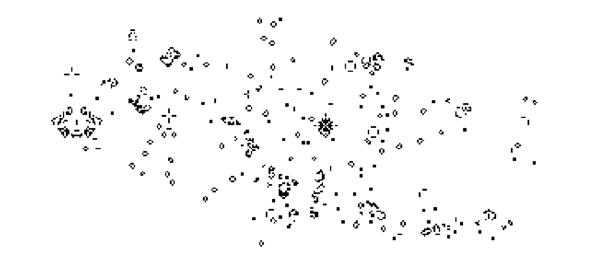
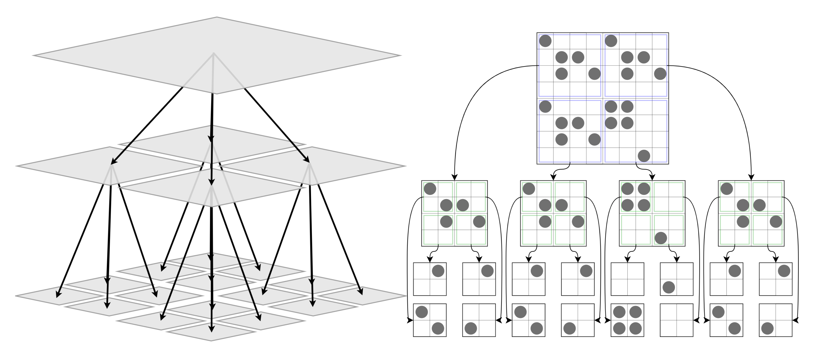
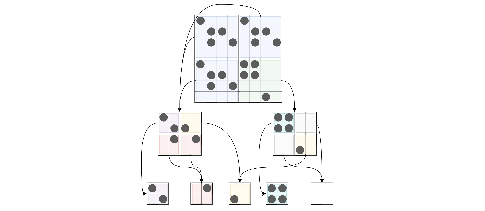
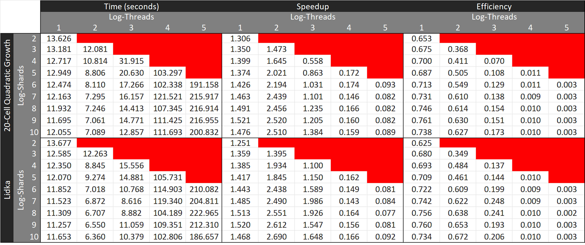
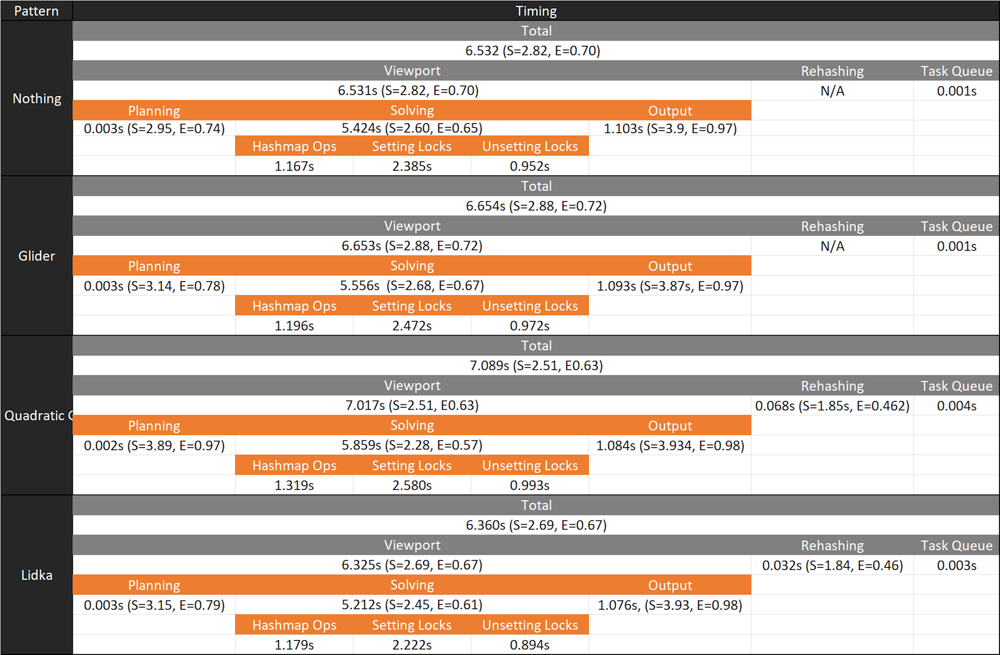

### **Morgan Sun**
### **UMID # 42756240**
### **EECS 587: Parallel Computing**
### **Final Project Report**

#

# 1. Introduction

This report discusses the development of a shared-memory parallel implementation of the Hashlife algorithm, an algorithm used to perform efficient simulation of Conway's Game of Life for extremely large numbers of timesteps.

## 1.1 Conway's Game of Life

Conway's Game of Life (hereafter referred to simply as "Life"), is a cellular automaton was devised by mathematician John Horton Conway in 1970 [1].
The "game" takes place in an universe consisting of an infinite, two-dimensional grid of square cells, each of which can be either alive or dead. 
Each cell has eight neighbors surrounding it on the grid.
The below figure shows an example of what a simulation state in Life might look like:

Life is a deterministic simulation, meaning its evolution is determined solely by its initial state and a set of simple rules governing the changes from one timestep to the next.
These rules are as follows:
- A live cell with 2 or 3 live neighbors survives.
- A live cell with fewer than 2 live neighbors or more than 3 live neighbors dies on the next timestep.
- A dead cell with exactly 3 live neighbors becomes live on the next timestep.

These simple rules result in complex emergent behavior; it is even possible to implement complex structures such as Turing machines within the simulation.

## 1.2 Simulating Life

The simplest method of simulating Life is to directly follow the rules, deriving each cell at time `t+1` from the eight neighbors at time `t`.
This naive method is sufficient for some applications.

However, attempting to use this methodology to perform more demanding simulations involving large patterns and numbers of timesteps isn't ideal.
This is because the naive method fails to exploit repetition in time or space.
If identical patterns exist in multiple separate areas of the universe, the naive method will redo the same computation for each instance of the repeated pattern.
Similarly, if a pattern is simulated once, then appears again at a later timestep, the naive method must re-simulate the pattern again from scratch.
This is especially problematic when one considers the fact that many interesting patterns in Life evolve in periodic and structured ways, which means that, in practice, the naive method ends up performing a lot of redundant computation.

## 1.3 The Hashlife Algorithm

Hashlife is an algorithm described by mathematician Bill Gosper in 1984 which takes a different approach to simulating Life [2].
It uses memoization to avoid performing repeated computations, addressing one of the main flaws of the naive method.

Hashlife consists of four main ideas: (1) representing the simulation state as a quad-tree, (2) extending the quad-tree to also represent the simulation state over time, and (3) using memoization to prevent redundant nodes in the quad-tree. These ideas combine to create a datastructure that can be queried to lazily evaluate the simulation state at arbitrary locations and timesteps.

The following sections will endeavor to provide a rough sketch of these ideas, although much detail is omitted for clarity and brevity.

### 1.3.1. Quad-Tree Representation

The naive method of simulating Life represents the simulation state as a 2D array of boolean cell states.

In comparison, Hashlife represents the simulation state using a tree structure. Each node in this tree represents a "macrocell", which is a square grid whose sidelength is a power of 2. Every macrocell larger than 1x1 can be divided into four quadrants; these quadrants are themselves also macrocells, and can also represented as tree nodes. Thus, each node in the tree has four children representing the northeast, northwest, southwest, and southeast macrocell quadrants. This subdivision continues until the bottom of the tree, which is comprised of indivisible single cells. This is illustrated in the figure [3] below:

### 1.3.2. Extending the Quad-Tree with RESULTs

The structure described in the previous subsections is only capable of representing the simulation state at a single point in time (i.e. `t = 0`). 
However, a simple modification to the quad-tree structure can be made such that it represents the simulation state at all timesteps `t >= 0`. 
This modification associates each node in the quad-tree with a "RESULT".

For a parent node representing a `2^(n+1)` by `2^(n+1)` macrocell existing at time `t` in the simulation, the RESULT of this node represents the `2^(n)` by `2^(n)` macrocell located spatially at the center of the parent node, but at time `t + 2^(n-1)`. The RESULT is computed recursively by constructing several smaller auxiliary macrocells and piecing together their RESULTs. The specifics of this process are omitted for brevity; Gosper's original paper describes the process in more detail.

RESULT computation is usually done in a lazy/on-demand manner, and once the computation is done, the RESULT is stored as a special fifth child node and doesn't need to be computed again. 

Of course, since the RESULT is itself a node in the tree representing some macrocell at time `t + 2^(n-1)`, it has its own RESULT existing at time `t + 2^(n-1) + 2^(n-2)`, which in turn also has a RESULT existing at `t + 2^(n-1) + 2^(n-2) + 2^(n-3)`, and so on. Thus by carefully traversing the tree, one can evaluate the simulation state at arbitrary timesteps. More specifically, to determine the simulation state at a time `2^a + 2^b + 2^c + ...`, where `a > b > c > ...`, one must compute intermediate states at times `2^a`, `2^a + 2^b`, `2^a + 2^b + 2^c`, and so on.

### 1.3.3. Memoization to Remove Redundant Nodes

The quad-tree structure described so far doesn't actually save any memory or offer any special capabilities when compared to using simple 2D arrays.
This is because it is still uses redundant representations of macrocells; that is, two identical macrocells that exist in different places or at different times are represented using distinct nodes.

A hashmap is used to remove this redundancy. Keys for the hashmap take the form of a tuple of four node pointers (northeast, northwest, southwest, and southeast); the corresponding value in the hashmap is a pointer to the node constructed from those four quadrants. Before constructing a new node to represent a macrocell, the Hashlife algorithm first checks the hashmap to see if a node representing that macrocell has already been constructed, and re-uses it if so. This ensures that only a single node is ever created to represent any given macrocell. This changes the quad-tree structure to look more like the figure [3] below:

This modification accomplishes two things. 
First, it serves as a method of compressing the quad-tree structure. 
Second, and much more importantly, it allows RESULT calculation to reused for identical macrocells that recur in different spatial locations or at different timesteps.

# 2. Development of Parallelized Hashlife

This section will describe the challenges involved in parallelizing Hashlife, as well as roughly outline the final implementation.

## 2.1. Distributed Memory

Initially, an attempt was made to implement Hashlife for distributed-memory systems using MPI. 
However, this ultimately proved impractical.

Serial Hashlife makes heavy use of a single hashmap, accessing it tens of thousands of times per timestep.
Outside of accessing this hashmap, however, the Hashlife algorithm involves no computational heavy lifting.
In fact, Hashlife exclusively uses integer-valued numbers and cheap arithmetic operations, making the logic in the algorithm remarkably computationally lightweight; additionally, this logic scales logarithmically as simulation duration increases.
Later experimental results will show that, in both the serial and shared-memory parallel implementations, the vast majority of time is spent accessing the hashmap.

This means that adding any overhead in accessing or maintaining the hashmap will quickly eliminate any speedup from parallelization.
This is the key challenge in parallelizing Hashlife.

A few methods of implementing the hashmap in a distributed-memory system were considered.

For example, one compute node could be assigned to be responsible for storing the hashmap, while other compute nodes could communicate with this node to access the hashmap.
However, this approach is absurd given that Hashlife contains relatively little computational work outside of accessing the hashmap. Communication overhead would far outweigh any possible gains from parallelization. The same problem applies to approaches involving splitting the hashmap across compute nodes.

Another idea considered involves storing one copy of the hashmap in the memory of each compute node, and to keep these hashmaps in sync through some form of reduction operation.
However, the hashmaps in Hashlife use memory addresses for both input keys and output values, as well as to disambiguate stored items in cases of hash collision.
Reducing multiple such hashmaps stored on different compute nodes would involve reconciling addresses associated with separate memory spaces.
This means that, even disregarding communication overhead, it would be impossible perform such a reduction in an economical manner.

It ultimately appears as if the only way to parallelize Hashlife effectively in a distributed-memory system is to run separate, non-interacting simulations on each node. Since such an approach wouldn't be very interesting, focus was shifted to developing a shared-memory parallel implementation of Hashlife instead.

## 2.2. Shared Memory

### 2.2.1. Hashmap

Switching to a shared-memory system eliminates the problem of managing multiple hashmaps, but introduces the problem of multiple threads concurrently accessing a performant shared hashmap.
The final solution implemented uses a hashmap implemented from scratch.
This hashmap can be accessed via a single method, which either returns the existing quad-tree node that corresponds to the four input nodes, or constructs and returns a new node.
The hashmap does not support modifying or removing items, as these functionalities aren't used by Hashlife.
Internally, the hashmap uses an open-addressed array of buckets.
This array is split into shards, which can be individually locked with OpenMP locks, allowing safe concurrent access.
Linear probing was selected as the open-addressing method, as this would minimize the average number of locks set in the event of a hash collision.

An alternative hashmap design that replaces locks with atomic operations to update the buckets was considered. 
However, after some testing, it was found that more sophisticated atomic operations than offered by OpenMP would be necessary for this, and due to time constraints, this design wasn't implemented.

### 2.2.2. Parallelization

Two approaches to parallelizing Hashlife were considered. 
One option was to parallelize RESULT computation.
As mentioned earlier, RESULT computation is done through a recursive process; this process could parallelized by using threads as workers to handle the recursively generated tasks in a depth-first manner.
However, this approach requires the datastructure managing RESULT computation tasks to be very frequently locked and unlocked, creating a bottleneck.

Instead, computation was parallelized across a set of user-specified "viewports" with each viewport representing a rectangular "slab" of spacetime in the simulation.
This method of parallelization makes practical sense, since typically the user will be interested in the dynamics of a pattern in Life, and will wish to render a large number of consecutive timesteps to observe the evolution of the simulation.
Viewports are allocated to threads using a simple task queue.

Because it generally isn't possible to predict the number of unique macrocells which will result from a given initial simulation state, the hashmap used in Hashlife must be periodically rehashed as the number of stored items grows. In the author's implementation, this is triggered when the load factor of any shard of the bucket array reaches 50%. When this happens, no additional viewport tasks are allocated, and the program waits for currently running viewport tasks to finish (this incurs some potential inefficiency, but later experimental results will show that this is not a concern in practice). All threads then switch to rehashing the hashmap, with each thread being assigned a contiguous portion of the bucket array to rehash. The hashmap stores hash values when new nodes are constructed and inserted, and therefore rehashing does not require recalculation of hash values, and is extremely fast.

Thus, at a high level, the author's parallel Hashlife implementation switches between two parallel blocks: one to compute viewports, and one to perform rehashing; this continues until all necessary viewports have been calculated.

# 3. Experiments and Results

This section discusses various experiments performed to verify the correctness of the author's parallel and serial Hashlife implementations, as well as to benchmark the performance of the parallel implementation and isolate the factors that affect this performance.

## 3.1. Verifying Correctness

Life is a deterministic cellular automaton, and there exist many initial configurations with well-documented evolution. It is therefore extremely straightforward to verify that a given algorithm implements Life correctly, as one simply needs to compare the algorithm's output to the expected result.

Several initial state patterns were used to validate the correctness of the author's implementations of Hashlife. Each pattern was simulated for 200000 steps using a viewport of size 400 by 100; in some cases, the viewport was moved over time to follow the most interesting part of the pattern. Each pattern was simulated using the author's implementations of parallel and serial Hashlife, as well as the simulator provided by LifeWiki [4], an online wiki page for documenting Life and other cellular automata. Patterns tested include:

- Nothing (empty space)
- Glider - the simplest "spaceship" (a pattern which moves across the grid)
- Lightweight spaceship - a slightly larger spaceship pattern
- R-Pentomino - one of the simplest "methuselahs" (patterns that start simple, then expand in a chaotic way for a finite number of timesteps)
- Lidka - a larger, more complex, and longer-lived methuselah
- 126932979M - a methuselah that expands into a highly structured and repetitive pattern lasting for an extremely long lifespan
- 20-Cell Quadratic Growth - a highly structured and repetitive pattern which exhibits endless quadratic growth in the number of living cells over time

These patterns represent a wide variety of simple and complex patterns in Life. Some of them will also be used later to benchmark the performance of Hashlife.

No discrepancies between the three algorithms tested were observed during the simulation of any of these patterns, which demonstrates the correctness of the author's serial and parallel Hashlife implementations.

## 3.2. Hyperparameter Optimization

The time needed for the parallel Hashlife implementation to simulate the "20-Cell Quadratic Growth" and "Lidka" patterns for 20000 timesteps was measured while adjusting two parameters: the number of threads, and the number of shards used in the hashmap.

Timing results, as well as corresponding Speedup and Efficiency values, are shown in the table below. Note that both the number of threads and the number of shards are listed as log-2 values. Also, note that, when the number of shards in the hashmap is less than or equal to the number of threads, there exists a miniscule but nonzero possibility of a deadlock occurring; therefore, such hyperparameter values were considered invalid and not tested.

This table shows that efficiency falls as the number of threads increases, which is likely due to increased overhead associated with each additional thread. Maximum speedup is achieved with four threads, beyond which performance rapidly falls below that of the serial version.

Efficiency and speedup also increase as the number of shards increases, which is likely due to decreased risk of multiple threads contending for the same shard in the hashmap.

For all subsequent experiments, unless otherwise stated, a combination of 4 threads and 1024 shards is used, as this combination demonstrates the greatest speedup in this experiment.

## 3.3. Component Timing

In order to better understand the factors that contribute to the performance of the parallel algorithm, the runtime/work per thread spent on individual components of the algorithm was measured for four different initial patterns. 

For each initial pattern, a total runtime was measured.
This time was subdivided into:
- time spent on calculating viewports
- time spent rehashing the hashmap
- overhead from task management and thread synchronization.

Time spent calculating viewports was further subdivided into three steps:

1. Planning: The portion of the algorithm which doesn't require hashmap access, and instead plans out how to traverse the quad-tree to compute the desired viewport.
2. Solving: The portion of the algorithm which consists exclusively of pre-planned hashmap accesses.
3. Output: Converting the result to a more user-friendly 2D grid of booleans.

The time spent on the "Solving" step is further subdivided into time spent setting and unsetting OpenMP locks, as well as the remaining time which is spent computing the hash function and actually updating the hashmap.

Measured times, along with Speedup ("S") and Efficiency ("E") are displayed in the table below.
For components that are performed in parallel, the times shown in the table are averages across all threads.

Interestingly, the complexity of the pattern being simulated does not appear to affect the runtime of the algorithm or its components.
The simulations of empty space and a single glider require essentially the same amount of time as the much more complex 20-Cell Quadratic Growth and Lidka patterns, with the only major difference being that the simple patterns don't trigger any rehashes, whereas the complex patterns require several rehashes. This is because the simple patterns generate a far smaller number of unique macrocells than the complex patterns, as shown in the table below:

However, even for the complex patterns, rehashing represents a very small fraction of the total work done. Task management and thread synchronization overhead is also nearly negligible, with the vast majority of work occurring in the calculation of viewports.

Speedup and Efficiency values shown in the table are illustrative, if not surprising. Both the "planning" and "output" steps of viewport calculation demonstrate nearly perfect efficiency; this is unsurprising, since these steps don't involve accessing the hashmap, and therefore these steps are essentially simply parallelized without any need for locks or other mechanisms for managing concurrency. The efficiency of these steps is dragged down, however, by the actual "solving" step, in which a substantial portion of the total time and work used by the algorithm is allocated to setting and unsetting OpenMP locks.

## 3.4. Hashmap Performance Scaling

In order to better understand why performance begins degrading past 4 threads, work and average-work-per-thread for hashmap access operations was measured for various numbers of threads. The results are shown in the table below:

Hashmap operations (specifically referring to operations that would be found in a serial, non-concurrency-safe hashmap implementation, e.g. calculating the hash function, updating the array) are parallelized quite effectively, as the total amount of work in this category remains relatively constant as the number of threads increases. Correspondingly, work-per-thread for hashmap operations approximately halves with every doubling of thread count. Work-per-thread required to unset locks also appears to decrease as the number of threads increases, though to a lesser extent. However, as the number of threads increases, the time required to set locks quickly becomes dominant, with the time per thread spent on setting locks increasing dramatically.

There are two factors that may contribute to an explanation of this behavior. 
First, as the number of threads increases, the risk of lock contention also increases, as there are theoretically more frequent accesses to the same hashmap shard.
This can result in increased time spent blocked, waiting for other threads to finish using hashmap shards.
Second, the overhead inherent in setting a OpenMP lock, even if the lock is initially unset, may increase with the number of threads.

To further investigate this, statistics regarding hashmap and lock access were collected for various numbers of threads, as well as various numbers of shards. These statistics track what happens, on average, when the hashmap is accessed: how many buckets are probed, how many shards need to be accessed (i.e. the number of locks set/unset), the amount of time spent setting locks, and the chance of needing to wait for the lock to be unset by another thread first.

These results are shown in the tables below:

For the vast majority of hashmap accesses, no hash collision occurs and only one bucket needs to be probed.
Furthermore, it is exceedingly rare for more than one shard to be accessed.
This remains true for all hyperparameters tested, which indicates that needing to set/unset *more* locks isn't related to changes in performance when using different hyperparameter combinations.

The results show that, as the number of threads used increases beyond 4, the contention rate (the percentage of attempts to set locks which result in waiting for the lock to first be unset) doesn't appear to increase substantially, which suggests that increased probability of lock contention is not a substantial factor contributing to declining performance when using increasing numbers of threads. However, the average time required to set a lock does increase substantially. This suggests that the overhead inherent in setting an OpenMP lock increases as the number of threads increases, and that this is the primary factor that prevents this parallel Hashlife implementation from scaling to larger numbers of threads.

It is also interesting to note that contention rate decreases as the number of shards increases.
This is to be expected, since an increased number of shards means a lower chance of two threads attempting to access the same shard, assuming an uniform random distribution in shard accesses.
This also explains the improvement in performance with larger shard counts observed in experiment 3.2.

However, it is notable that contention rate only decreases to around 33%, even with very many shards being used.
This can be attributed to the fact that certain macrocells are much more common than others in the Life simulations tested; this results in a non-uniform distribution of shard accesses, as the hashmap entries corresponding to these macrocells are more frequently accessed, leading to contentions that cannot be avoided by breaking the hashmap up into more shards.

# 4. Conclusion and Further Work

This project has successfully demonstrated the feasibility and efficiency of a shared-memory parallel implementation of the Hashlife algorithm for simulating Conway's Game of Life. Experiments were done to characterize the performance of the implementation for different inputs and with different hyperparameter combinations. Based on the results of the experiments discussed in section 3, improving the performance of parallelized Hashlife running on a shared-memory system is likely dependent on decreasing the impact locks have on performance and scaling of the hashmap used in Hashlife.
One way to accomplish this might be through a lock-less hashmap, as discussed in subsection 2.2.1.

# 5. References

[1] M. Gardner, "Mathematical Games," Scientific American, vol. 223, no. 4, pp. 120-123, 1970. [Online]. Available: http://www.jstor.org/stable/24927642. Accessed: Jan. 22, 2024.

[2] R. Wm. Gosper, “Exploiting regularities in large cellular spaces,” Physica D: Nonlinear Phenomena, vol. 10, no. 1–2, pp. 75–80, 1984. doi:10.1016/0167-2789(84)90251-3 

[3] Ninguem, “Ninguem,” /dev/.mind, https://www.dev-mind.blog/hashlife/ (accessed Jan. 22, 2024). 

[4] “Main page,” LifeWiki, https://conwaylife.com/wiki/Main_Page (accessed Jan. 22, 2024). 